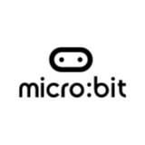

# micro:bit playground of chris-scientist

I created this GitHub Organization to add my experiments on micro:bit.

## Notes

For my projects on the micro:bit, I mainly use `Visual Studio Code` with `PlatformIO`.

## Me

More informations on me :
* [On my GitHub](https://github.com/chris-scientist).
* [On my website - in french only](https://chris-scientist.github.io)
